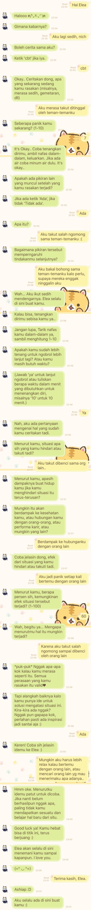

# Elea Chatbot

Elea Chatbot adalah sebuah chatbot yang mendampingi pengidap setiap hari untuk membantu pengidap gangguan jiwa menjadi lebih baik.

**Tambahkan Elea dengan menggunakan QR Code ini:**

# Bagaimana Cara Menggunakan Elea Chatbot?

1. Pastikan Anda sudah menginstall aplikasi LINE Messenger.
2. Cari Elea Chatbot melalui 'cari berdasarkan ID' atau 'tambahkan melalui QR Code' pada LINE Messenger.
3. Setelah Elea ditambahkan sebagai teman, Elea akan otomatis menanyakan status emosi setiap hari. Pengguna tinggal memberikan input jenis emosi yang disediakan Elea.
3. Aktifkan Mode CBT dengan keyword-keyword tertentu seperti, "aku sedih", "aku putus asa", atau kata-kata negatif semacamnya. Selain itu, mode CBT juga dapat diaktifkan dengan mengatakan "CBT".
4. Dalam proses CBT, pengguna dapat mengikuti instruksi CBT yang diberikan oleh Elea dengan menjawab pertanyaan-pertanyaan Elea.

